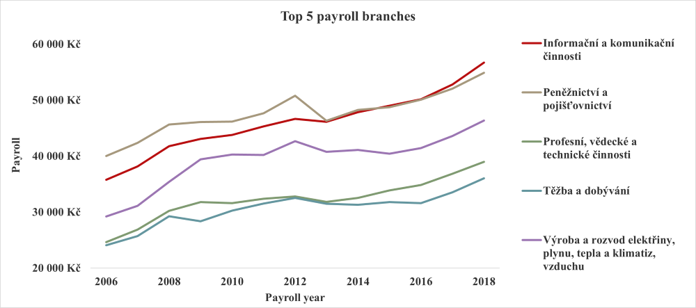
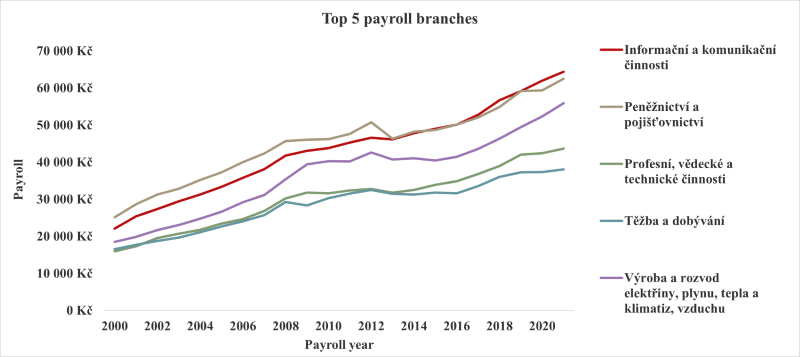

# Název projektu: Projekt z SQL

**Autor:**  
Barbora Rasticová  
**Datum odevzdání:**  
červenec 2025  

---

## 1. Zadání projektu:

Na analytickém oddělení nezávislé společnosti zabývající se životní úrovní občanů, bylo vydefinováno několik výzkumných otázek, které se zaměřují na dostupnost základních potravin široké veřejnosti.  
Cílem projektu je připravit robustní datové podklady, ve kterých bude možné vidět porovnání dostupnosti potravin na základě průměrných příjmů obyvatel v rámci vybraného časového období.  
Součástí výstupu je také vytvoření přehledové tabulky obsahující údaje o HDP, GINI koeficientu a populaci dalších evropských států pro stejné období jako pro primární přehled ČR.  
Výsledky analýzy budou sloužit jako podklad pro prezentaci na následující konferenci zaměřené na tuto oblast.

---

## 2. Použité datové sady (tabulky):

a) `czechia_payroll` – Informace o mzdách v různých odvětvích za několikaleté období. Datová sada pochází z Portálu otevřených dat ČR.  
b) `czechia_payroll_industry_branch` – Číselník odvětví v tabulce mezd.  
c) `czechia_payroll_value_type` – Číselník typů hodnot v tabulce mezd.  
d) `czechia_price` – Informace o cenách vybraných potravin za několikaleté období. Datová sada pochází z Portálu otevřených dat ČR.  
e) `czechia_price_category` – Číselník kategorií potravin, které se vyskytují v našem přehledu.  
f) `countries` – Všemožné informace o zemích na světě, například hlavní město, měna, národní jídlo nebo průměrná výška populace.  
g) `economies` – HDP, GINI, daňová zátěž, atd. pro daný stát a rok.  

---

## 3. Tvorba primární tabulky (`t_barbora_rasticova_project_SQL_primary_final`):

Obsahuje data mezd a cen potravin za Českou republiku sjednocených na totožné porovnatelné období.  
Primární tabulka byla vytvořena pomocí spojení 5 prvních tabulek (viz bod 2). Výsledná tabulka obsahuje data od roku 2006 do roku 2018, jedná se o společné roky v obou tabulkách `czechia_payroll` a `czechia_price`. Jako `calculation_code` byl vybrán code 200 tj. přepočtený (ukazuje mzdu vztaženou na 1 celý pracovní úvazek).  
Při tvorbě byly použity agregační funkce (např. `AVG`) pro výpočet průměrných ročních cen potravin dle kategorií a následně i celkové průměrné ceny potravin. Tento dvoustupňový průměr pomáhá eliminovat zkreslení způsobené nerovnoměrným počtem záznamů mezi jednotlivými kategoriemi. Stejný princip byl aplikován i při výpočtu průměrných mezd.

Při tvorbě tabulky byly také nalezeny některé anomálie, díky kterým musela být data upravena:

- Pro potravinu **212101 (Jakostní víno bílé)** chybí některé hodnoty. Relevantní data se objevují až od roku 2015. Z důvodu možného zkreslení dat nebyla tato potravina zahrnuta do analýzy.
- Pro jednotlivé kategorie nejsou uvedeny jednotné porovnatelné jednotky. U některých potravin tak muselo dojít k přepočtu, a to konkrétně:
  - jogurt bílý netučný (uvedeno 150 g → 1 kg)
  - pivo výčepní, světlé, lahvové (0,5 l → 1 l)
  - hodnota pro vajíčka byla ponechána na 10 ks (standardně uváděné jednotky)
- Přehozené jednotky pro průměrný počet zaměstnaných osob a průměrnou hrubou mzdu.  
  Pro hodnotu 316 (Průměrný počet zaměstnaných osob) je přiřazena hodnota 80403 (značící Kč), naopak pro hodnotu 5958 (Průměrná hrubá mzda na zaměstnance) je přiřazena hodnota 200 (tis. osob (tis. os.)).  
  Hodnoty by měly být přiřazeny naopak, tedy:
  - Průměrný počet zaměstnaných osob → tis. osob (tis. os.)
  - Průměrná hrubá mzda na zaměstnance → Kč  
Nicméně ve výsledné tabulce se tento sloupec nevyskytuje.

---

## 4. Tvorba sekundární tabulky (`t_barbora_rasticova_project_SQL_secondary_final`):

Tabulka byla vytvořena spojením dat z tabulek `economies` a `countries`. Časové období bylo omezeno na roky 2006–2018 na základě dat z primární tabulky. Výběr byl dále omezen pouze na evropské státy, které byly identifikovány pomocí tabulky `countries`.  
Pro hodnoty populace byla použita data z tabulky `economies` – data jsou zde dostupná pro každý jednotlivý rok, na rozdíl od tabulky `countries`, kde je dostupná pouze jedna hodnota bez uvedeného roku.  
V obou použitých tabulkách se vyskytují duplicitní záznamy, ve výsledné tabulce tak muselo dojít k jejich odstranění.  
Ve výsledné tabulce také chybí data pro 3 země:

- Holy See (Vatican City State)
- Northern Ireland
- Svalbard and Jan Mayen

Pro tyto země kompletně chybí data o GDP, GINI a populaci (resp. populace je dostupná pouze z tabulky `countries` ale ne pro jednotlivé roky).

---

## 5. Analyzované otázky:

### 1) Rostou v průběhu let mzdy ve všech odvětvích, nebo v některých klesají?

U všech sledovaných kategorií dochází průměrně k nárůstu mezd.  
Rychlost růstu se u jednotlivých kategorií liší – u některých je mírnější, u jiných výraznější – nicméně ve všech případech dochází k postupnému zvyšování.  
Pro lepší srovnání byla data také exportována a vizualizována v Excelu. Kvůli přehlednosti graf zachycuje pouze 5 odvětví s nejvyššími průměrnými mzdami jako ilustrativní příklad.

---

### 2) Kolik je možné si koupit litrů mléka a kilogramů chleba za první a poslední srovnatelné období v dostupných datech cen a mezd?

- **2006**: 1309,6 kg chleba nebo 1464,2 litrů mléka  
- **2018**: 1365,2 kg chleba nebo 1668,6 litrů mléka  

---

### 3) Která kategorie potravin zdražuje nejpomaleji (je u ní nejnižší percentuální meziroční nárůst)?

Pozn. Pro výpočet průměrného meziročního růstu byl použit ukazatel **CAGR** (Compound Annual Growth Rate) pro jednotlivé kategorie potravin. Tento ukazatel umožňuje vyjádřit celkový růst za celé sledované období formou průměrného ročního tempa a tím také snadněji porovnat vývoj mezi jednotlivými kategoriemi potravin.

Výsledky ukazují, že u dvou sledovaných potravin – **cukru krystalu a rajských jablek** – je hodnota CAGR záporná, tzn. v průběhu sledovaného období došlo k mírnému zlevnění.  
U ostatních kategorií je CAGR kladné. Nejnižší meziroční nárůst mezi nimi vykazují **banány (0,59 %)**, a lze je tedy označit za potravinu, která zdražovala nejpomaleji.

---

### 4) Existuje rok, ve kterém byl meziroční nárůst cen potravin výrazně vyšší než růst mezd (větší než 10 %)?

**Ne.** V analyzovaných datech ani v jednom roce nepřevýšil meziroční nárůst cen potravin meziroční růst mezd o více než 10 procentních bodů.  
Nejvyšší rozdíl byl zaznamenán v roce **2013**, kdy ceny potravin rostly výrazněji než mzdy – konkrétně o **6,8 procentních bodů**.

---

### 5) Má výška HDP vliv na změny ve mzdách a cenách potravin?

**MZDY:** Vývoj HDP má do určité míry vliv na mzdy s cca 1ročním zpožděním – firmy reagují na růst ekonomiky zvýšením platů. Toto tvrzení ale neplatí celkově pro všechny sledované roky.  
Například:

- HDP prudce kleslo v roce 2009 (−4,7 %) → mzdy výrazněji zpomalily růst v roce 2010 (+1,9 %).
- V roce 2014 vzrostl HDP o 2,3 %, ale mzdy zůstaly téměř stejné jako předchozí rok (+2,6 % v roce 2014, stejně jako v 2013, kdy HDP bylo 0 %).

**CENY POTRAVIN:** Vazba na HDP je velmi slabá, a to jak ve stejném, tak následujícím roce. Vývoj cen potravin tak může ovlivňovat více faktorů (např. klimatické vlivy, zemědělská produkce).  
Například:

- Růst HDP v roce 2015 (+5,4 %) byl následován poklesem cen potravin v roce 2016 (−1,5 %).
- Naopak v roce 2017, kdy HDP vzrostl o 5,2 %, se ceny potravin zvýšily až o 10 % – zde se souvislost zdá zřetelnější.